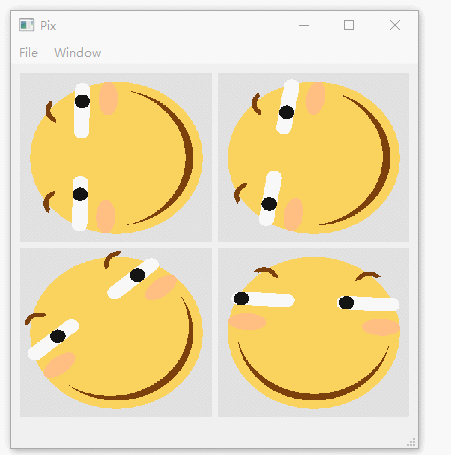

# PIX——像素绘图
- #### **核心：**

  本项目使用C++/Qt。调用QImage类的成员函数setPixel(r,g,b)填充一个QImage对象。

  - 函数setPixel(x,y,c)——设置坐标(x,y)的像素点的颜色为c(r,g,b)。

- #### **特性：**

  - 采用Qt插件机制，编写Qt插件实现接口函数，完成绘图功能；
  - 可以作为学习图形学的练习，画任何你想画的东西；

- #### **接口说明：**

  - 目前接口paintImg()：传入一个QImage的引用img，与绘图参数param,函数中实现对img的内容填充绘制。每当鼠标移动、键盘按下或者计时器事件触发时，都会调用此函数重新计算QImage的内容，重绘。

    `void paintImg(QImage& img, const Param& param);`

  - 关于绘图参数：Param结构体，包含了绘图所需的信息，如当前鼠标位置，键盘按下情况，时间等，通过这些参数在绘制中被考虑进去，可以实现鼠标键盘的交互和动画。

- #### **代码文件夹：**

		pix	┬ bin：编译结果。二进制文件。
		
			├ src	┬ mainwindow：框架。主窗口，定义了接口，以及主界面与绘图区域等 。
			
			│	├ plugins：插件。coder们可以提供接口实现（一些有趣的效果），写自己的插件。
			
			│	└ libs：通用的。定义了一些公用的数据结构啊和变换函数等（暂定）。
			
			└ readme.md：本文档。
      
- #### **使用方法：**

  - 拖拽plugin文件夹内的插件到窗口即可加载。

- #### **程序截图：**

  - screenshot:

    

  - Link: [滑稽大军传送门](https://www.zhihu.com/question/51314788/answer/673470214)

------

###### have fun !

###### Created by tyw66 at 5.5 / 2019

###### Updated by tyw66 at 5.20 / 2019
